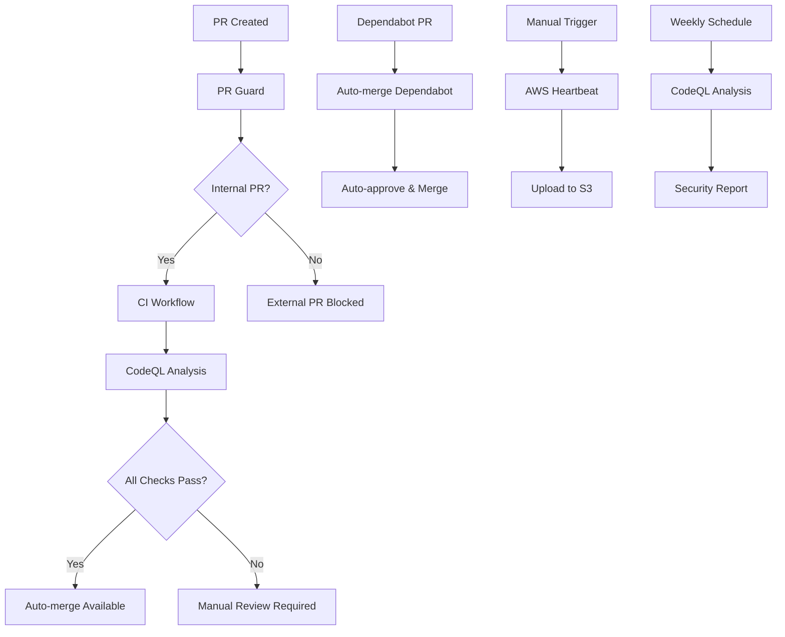

# GitHub Actions Workflow Dependencies

This document describes the dependency relationships between GitHub Actions workflows in the Bedrock repository.

## Workflow Overview

## Workflow Dependencies

### 1. **PR Guard** → **CI** → **CodeQL**
- **Trigger**: `pull_request_target` on PR events
- **Purpose**: Validates PR changes and security policies
- **Dependencies**: None (entry point)
- **Blocks**: External PRs from modifying CI/CD files

### 2. **CI** → **Auto-merge**
- **Trigger**: `pull_request` on main branch
- **Purpose**: Builds and tests the project
- **Dependencies**: PR Guard approval
- **Required for**: Auto-merge workflow

### 3. **CodeQL** → **Auto-merge**
- **Trigger**: `pull_request` on main branch, weekly schedule
- **Purpose**: Static security analysis
- **Dependencies**: CI completion
- **Required for**: Auto-merge workflow

### 4. **Auto-merge Dependabot**
- **Trigger**: `pull_request` from `dependabot[bot]`
- **Purpose**: Automatically merges dependency updates
- **Dependencies**: None (independent)
- **Bypasses**: Manual review requirements

### 5. **Auto-merge** (Trusted Users)
- **Trigger**: `pull_request` from `MarkBedrock` or `UnderLord`
- **Purpose**: Auto-merges PRs after all checks pass
- **Dependencies**: CI + CodeQL success
- **Requirements**: All status checks must pass

### 6. **AWS Heartbeat**
- **Trigger**: Manual dispatch, scheduled
- **Purpose**: Maintains AWS connectivity
- **Dependencies**: None (independent)
- **Frequency**: Weekly (Phoenix), Manual (Bedrock)

## Critical Paths

### **Standard PR Flow:**
1. PR Guard validates changes
2. CI builds and tests
3. CodeQL analyzes security
4. Auto-merge (if from trusted users)

### **Dependabot Flow:**
1. Dependabot creates PR
2. Auto-merge Dependabot immediately processes
3. No manual intervention required

### **Security Flow:**
1. PR Guard blocks external CI changes
2. CodeQL runs on all PRs
3. Security issues block auto-merge

## Failure Scenarios

- **PR Guard fails**: External PRs blocked from CI changes
- **CI fails**: Auto-merge blocked, manual review required
- **CodeQL fails**: Security issues prevent auto-merge
- **Auto-merge fails**: Manual intervention required

## Monitoring

- **Status badges**: Display in README.md
- **Notifications**: GitHub notifications on failure
- **Logs**: Available in Actions tab
- **Artifacts**: Build logs uploaded on failure
